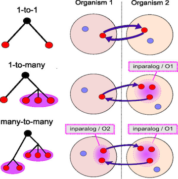

# 

#Orthologs and Paralogs


## Gene families and Orthology

Problem: How to find "same" genes across multiple species.

Genes can duplicate (Paralogs) and can be identical due to descent (Ortholog)

.center[]

## Methods

* BLAST: 1 way BLAST (Gene A in Species X, what is best hit in Species Y)
* BLAST: reciprocal BLAST

.center[]


## Trees can help resolve relationships

Best hits can sometimes be wrong (B) though it can be resolved with phylogenetics.


## Reciprocal Searches

* Bi-directional or Reciprocal BLAST


## Implement Bidirectional

Method to find best top hit in one direction and the reverse.

Let's walk through the [code](https://github.com/hyphaltip/htbda_perl_class/blob/master/examples/Orthologs/bidirectional.pl)

_Will write this in Python in Class_


## Clustering

* Lumping genes together based on similarity linkage
* Single-linkage means if there is a link between A-B then they are in a cluster


## Code up single-linkage

Let's look at some [code](https://github.com/hyphaltip/htbda_perl_class/blob/master/examples/Orthologs/single_linkage.pl).

_Will write this in Python in Class_


## Issues

.center[]


## Existing solution

* OrthoMCL - requires SQL Database
* Orthagogue - nearly identical results but runs w/o DB


## Steps to build orthologs on cluster

Make sure genome protein FASTA file is
```
>SPECIESPREFIX|GENENAME
```     

See [https://github.com/biodataprog/GEN220_2019_examples/tree/master/Bioinformatics_1](https://github.com/biodataprog/GEN220_2019_examples/tree/master/Bioinformatics_1) for example script for running orthofinder.

```bash
#!/usr/bin/bash
#SBATCH --ntasks 16 --mem 8G -p short
module load ncbi-blast
module load orthofinder
module load miniconda2
CPU=8

mkdir -p cyanobacteria
cd cyanobacteria
curl -L -O ftp://ftp.ensemblgenomes.org/pub/bacteria/release-45/fasta/bacteria_10_collection/oscillatoriales_cyanobacterium_jsc_12/pep/Oscillatoriales_cyanobacterium_jsc_12.ASM30994v1.pep.all.fa.gz
curl -L -O ftp://ftp.ensemblgenomes.org/pub/bacteria/release-45/fasta/bacteria_0_collection/nostoc_punctiforme_pcc_73102/pep/Nostoc_punctiforme_pcc_73102.ASM2002v1.pep.all.fa.gz
curl -L -O ftp://ftp.ensemblgenomes.org/pub/bacteria/release-45/fasta/bacteria_4_collection/cyanobacterium_aponinum_pcc_10605/pep/Cyanobacterium_aponinum_pcc_10605.ASM31767v1.pep.all.fa.gz

for file in *.fa.gz
do
 m=$(basename $file .pep.all.fa.gz)
 pigz -dc $file > $m.fasta
done
pigz -k *.fa.gz
cd ..

orthofinder.py -a $CPU -f cyanobacteria
```

# Ortholog results

Opening the file cyanobacteria/Results_Nov08/Orthogroups.txt

## Format

```GroupName\tSp1_Gene1, Sp1_Gene2\tSp2_Gene1, Sp2_Gene2\tSp3_Gene1, Sp3_Gene2```


```
	Cyanobacterium_aponinum_pcc_10605.ASM31767v1	Nostoc_punctiforme_pcc_73102.ASM2002v1	Oscillatoriales_cyanobacterium_jsc_12.ASM30994v1
OG0000000			EKQ66605, EKQ66611, EKQ66662, EKQ66782, EKQ66954, EKQ66984, EKQ67084, EKQ67085, EKQ67278, EKQ67284, EKQ67330, EKQ67344, EKQ67361, EKQ67366, EKQ67368, EKQ67427,
 EKQ67433, EKQ67590, EKQ67680, EKQ67799, EKQ67807, EKQ67983, EKQ68026, EKQ68032, EKQ68054, EKQ68173, EKQ68296, EKQ68354, EKQ68495, EKQ68500, EKQ68912, EKQ69012, EKQ69027, EKQ69073, EKQ69085,
EKQ69279, EKQ69300, EKQ69345, EKQ69368, EKQ69506, EKQ69549, EKQ69629, EKQ69630, EKQ69655, EKQ69739, EKQ69760, EKQ69872, EKQ69984, EKQ70005, EKQ70023, EKQ70046, EKQ70130, EKQ70179, EKQ70602, E
KQ70786, EKQ70840, EKQ70870, EKQ70894, EKQ71088, EKQ71090, EKQ71265, EKQ71335
OG0000001	AFZ52442, AFZ54265, AFZ54640	ACC78968, ACC78978, ACC79054, ACC79090, ACC79138, ACC79182, ACC79941, ACC80158, ACC80645, ACC81000, ACC81451, ACC81520, ACC81612, ACC81781, ACC
81797, ACC82091, ACC82628, ACC82978, ACC83035, ACC83215, ACC83711, ACC84528, ACC84844, ACC84851, ACC85118, ACC85266, ACC85421	EKQ66618, EKQ66620, EKQ66621, EKQ67508, EKQ68220, EKQ69508, EKQ
69971, EKQ69995, EKQ70003, EKQ70556, EKQ70833, EKQ71286
OG0000002	AFZ55137	ACC79344, ACC80485, ACC80595, ACC82143, ACC82836, ACC82962, ACC83845, ACC83999, ACC84046, ACC84047, ACC84257, ACC84700, ACC84955, ACC84966, ACC84970, ACC84971,
 ACC84972, ACC84974, ACC84981, ACC84982, ACC84983, ACC85032	EKQ66950, EKQ67597, EKQ67615, EKQ68095, EKQ68496, EKQ68499, EKQ69362, EKQ69910, EKQ69959
OG0000003	AFZ53198	ACC78875, ACC78976, ACC79256, ACC79524, ACC79759, ACC80145, ACC80528, ACC80591, ACC80631, ACC80670, ACC80818, ACC81317, ACC81502, ACC82310, ACC82674, ACC82718,
 ACC82769, ACC83025, ACC83081, ACC83457, ACC83602, ACC83721, ACC83749, ACC84422, ACC85331	EKQ69908
OG0000004		ACC80422, ACC80525, ACC80662, ACC80851, ACC80857, ACC80914, ACC81440, ACC81547, ACC81570, ACC81705, ACC81945, ACC81949, ACC81968, ACC81987, ACC82586, ACC83096, ACC8342
6, ACC83981, ACC84622, ACC84732, ACC85457	EKQ66830, EKQ66911, EKQ67039, EKQ67311, EKQ69997, EKQ70735
OG0000005	AFZ52318, AFZ52611, AFZ52613, AFZ52925, AFZ52973, AFZ53626, AFZ53840, AFZ53841, AFZ53849, AFZ53949, AFZ54004, AFZ54551, AFZ54904, AFZ55229	ACC80197, ACC81960, ACC82068, A
CC82559, ACC83603, ACC83674, ACC85005, ACC85009	EKQ67574, EKQ67809, EKQ69976
OG0000006	AFZ52319, AFZ53394, AFZ54017, AFZ54472	ACC79360, ACC79745, ACC79853, ACC80832, ACC80867, ACC81560, ACC82363, ACC82406, ACC82436, ACC82585, ACC84067, ACC84385	EKQ67267, EKQ67
478, EKQ67551, EKQ67724, EKQ67810, EKQ68266
OG0000007	AFZ53704, AFZ54461, AFZ54462	ACC79786, ACC80242, ACC80282, ACC80538, ACC80768, ACC81387, ACC82067, ACC83125, ACC83317, ACC83447, ACC84291, ACC84302, ACC85008	EKQ6767
2, EKQ68369, EKQ70142, EKQ70145, EKQ71300
```

# Write script to turn this into a table

```
ORTHOLOG_GRP	SP1   SP2    SP3
ORTHO_0001         10     5
ORTHO_0002          1     1
```

