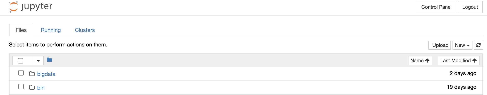
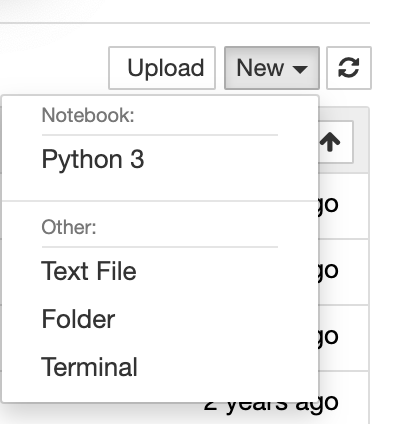
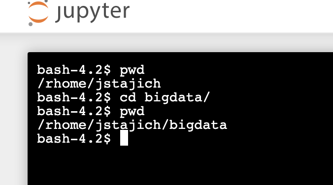
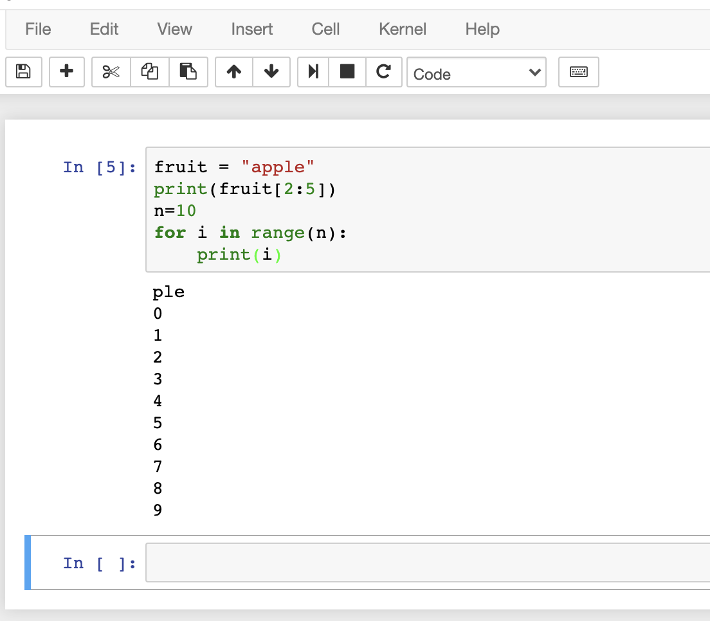
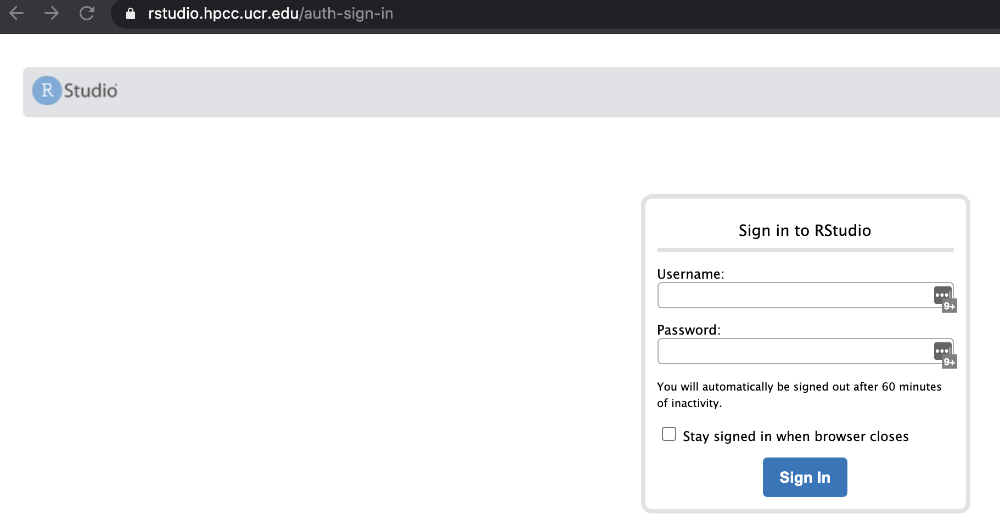

# Getting started

This class will emphasize UNIX skills to support doing genomics and evolutionary analysis with bioinformatics tools. There are many many tutorials and workshops out there. Many are available for free and linked here

* [Data Carpentry](https://datacarpentry.org/) and [Software Carpentry](https://software-carpentry.org/) part of [The Carpentries](https://carpentries.org/)
* [Data Intensive Biology training](https://dib-training.readthedocs.io/en/pub/) like [Shell Genomics](https://github.com/ngs-docs/2015-shell-genomics)
* [Getting Started with Genomics Tools](https://github.com/crazyhottommy/getting-started-with-genomics-tools-and-resources)
* [Happy Belly Bioinformatics](https://astrobiomike.github.io/unix/)


## Logging into Cluster

You will need to have a terminal to get onto the system. On Mac that is called 'Terminal'.
On Windows [MobaXTerm](https://mobaxterm.mobatek.net/) is the best tool. Choose the 'Free' and 'Portable Version'.

Existing documentation and tutorial available at http://hpcc.ucr.edu/ for using the HPCC.

See the [Linux Basics](http://hpcc.ucr.edu/manuals_linux-basics_intro.html)

To login to the cluster we need to use ssh client. This allows secure communication with the cluster. The UCR cluster is accessed using the host `cluster.hpcc.ucr.edu`.

```
$ ssh -X USERNAME@cluster.hpcc.ucr.edu
```

This will initiate a [UNIX](https://en.wikipedia.org/wiki/Unix) session running on the cluster 'head node' by connecting through a secure connection. There are multiple machines which serve as this login node where we can stage our analysis to run on the worker nodes that are on the cluster so you may see different names like 'pelican', 'pigeon' when you log in each time. Much more detail on the setup of the cluster and resources available at http://hpcc.ucr.edu.

You should now see a message as well as a prompt:

```

--------------------------------------------------------------------------------
 University of California, Riverside - HPCC (High-Performance Computing Center)
--------------------------------------------------------------------------------

More information about HPCC and how to use the resources provided can
be found at http://hpcc.ucr.edu/manuals_linux-cluster_intro.html

Please send all questions and support requests to support@hpcc.ucr.edu

Note: The default version of R is now 3.6.0
--------------------------------------------------------------------------------

username@pelican:~$
```

Let's setup some initial things. Make a SSH folder so we can copy thing over.

```bash
[hpcc] $ mkdir ~/.ssh
[hpcc] $ chmod 700 ~/.ssh #  sets the permission for this folder
```

You want to change your password on the cluster to something only you know.
This is good practice since your password was emailed to you.  It will prompt you for your
current password and a new one.

```
[hpcc] $ passwd
```

You can log off by typing
* `exit`
* ^D (Control-D)


The prompt on our system by default will start with the name of the computer as well as the current directory you are logged into. This prompt like most things on the system can be customized.
```
hostname:[directory]$
```
The `-X` option tells the system to [forward your X11 connection](https://kb.iu.edu/d/bdnt) which is necessary for running interactive graphics (eg showing an image, running a graphical editor program like emacs)

# The command line interface (CLI)

The command line provides ability to interact with the filesystem (files and folders) and run programs. A collection of UNIX utilities.

## Directories and files

**ls**  - list the files and folders in a directory. Options include `-l` to list with details (long). `-t` list ordered by time created (time). These can be combined as `ls -ls` or `ls -l -s`. Specify a folder to list other than the current directory with another argument `ls -l data`.


**mkdir** Create a directory. Give the `-p` option to create an necessary sub folders and also to not give warnings if a folder already exists.

```bash
$ mkdir test
$ mkdir Alpha/Beta/Zeta # will give error
$ mkdir -p Alpha/Beta/Zeta # will not give error
```

***rmdir*** Remove a folder. Only works if folder is empty

***rm*** Remove a file or folder. This is command to be careful with. To delete a folder that contains many folders you can use.

```
rm -rf # USE WITH CAUTION, THIS WILL RECURSIVELY DELETE
```

***cd*** To navigate into a directory.  Use this to go to different directories.

* `cd dirname` - go to a directory
* `cd /bigdata/gen220/shared` - can be an absolute path
* `cd simple` - or a relative directory (eg the dir `simple`  that is in the folder).
* `cd ..` - go up a directory
* `cd` or `cd ~` - go to the home directory
* `cd -` - go to the last directory

***pushd/popd*** - like cd but keep track of all the directories you were in.
```bash
[~] $ pushd /bigdata/gen220
[/bigdata/gen220] $ # now you are in a new directory
pushd /tmp
[/tmp] $ # now you are in another directory
[/tmp] $ cd # go back to your home dir
[~] $ popd
[/tmp] $ # you are now in last dir pushed on the stack
[/tmp] $ popd # will go back to last dir pushed on the stack
[/bigdata/gen220] $  # will go back to last dir pushed on the stack
```
This is different from `cd -` because it remembers the last directory you were in when you issued `pushd`. So you can use it like a bookmark to get you back to a specific place despite any of the other comamnds.

***pwd*** Print the current working directory. Helpful to remember where you are.

```
pwd
```

***realpath*** Print out the full path to a file. If it is a symlink print out where the original file is located.

```bash
$ cd  /bigdata/gen220/shared/simple
$ ls -l
lrwxrwxrwx 1 jstajich gen220    20 Sep 30 12:06 gene_names.txt -> yeast_gene_names.txt
-rw-r--r-- 1 jstajich gen220   603 Oct 10  2018 numbers_floating.dat
-rw-r--r-- 1 jstajich gen220 22447 Oct 10  2018 rice_random_exons.bed
-rw-rw-r-- 1 jstajich gen220 33894 Sep 30 12:05 yeast_gene_names.txt
$ realpath yeast_gene_names.txt
/bigdata/gen220/shared/simple/yeast_gene_names.txt
$ realpath gene_names.txt
/bigdata/gen220/shared/simple/yeast_gene_names.txt
```


**more** See the contents of a text file, one page at a time. Go to the next page with 'space'. Can search for a specific text with slash (`/`).

```bash
$ more /bigdata/gen220/shared/simple/yeast_gene_names.txt
```

**less** See the contents of a text file, one page at a time. Less has *more* options than **more** with arrows which will let you navigate up and down pages and a search option - use the slash (`/`) and then type in a search text it will highlight all the options.

```bash
$ less /bigdata/gen220/shared/simple/yeast_gene_names.txt
```


**head** see the first lines in a file. By default this is 10 lines. But you can specify as many as you want with `-n LINES` option.   Useful to get the beginning of a report or see what is the header in a spreadsheet file.
```bash
# here's an example that will work on the cluster
head -n 15 /bigdata/gen220/shared/simple/numbers_floating.dat
```

**tail** see the last lines in a file.  By running this command can see the last 10 lines by default. Can specify number of lines with `-n LINES` option.  Useful when looking at a log-file and want to see the last reported messages.
```bash
tail -n 12 FILE.txt
# here's an example that will work on the cluster
tail -n 3 /bigdata/gen220/shared/simple/numbers_floating.dat

```

**echo** Prints out messages.
```bash
echo "hello there"
# if you want to use special characters like tab (\t) you need to specify -e when you run echo
echo -e "Chrom\tStart\tEnd"
```

## Logging in with SSH keys

Let's make it simpler to login to the cluster without having to type our password all the time. This is a **ONE TIME CONFIGURATION**, you don't need to do this every time you connect, you only will need to setup for your laptop to connect using these keys. These keys are also useful when we start using github to commit your code as it will also use this connection mechanism. If you are using an in-class laptop you'll need to keep using that same one over the course of the class or re-do this step.

If you are using mobaxterm or other system that will SAVE your password then you really don't have to do this step for ssh keys for connecting (though it will still be useful for the github connecting).

SSH-keys will allow you to setup connection to the server without having to use your server password each time. You can specify a key-pair that will work for your laptop to connect to the server.

### Setup your SSH access on your computer (your laptop).
Generate RSA key pair on your computer. It will ask you for a password. You get to pick any password here you can remember. This will be a different password from your cluster one.

```bash
[your laptop] $ ssh-keygen -t rsa
```

See the new files created
```bash
[your laptop] $ ls ~/.ssh/
[your laptop] $ id_rsa id_rsa.pub
```

Let's also configure how our ssh works by customizing the ssh config. We need to
edit a text file. On OSX this can be with `vi`, `emacs`, `nano`

```bash
nano ~/.ssh/config
```

```
ForwardX11 yes
ForwardX11Trusted yes
ForwardAgent yes

Host hpcc
 Hostname cluster.hpcc.ucr.edu
 User YOURHPCCUSERNAME
 ServerAliveInterval 10
 ```

 This will open up a window for editing. You should add this content to your file.
 Here's [a file you can copy onto the server too](ssh-config_example.txt).
 `scp ssh-config_example.txt YOURHPCCUSERNAME@cluster.hpcc.ucr.edu:.ssh`

Now you need to copy your ssh key FROM your laptop TO the cluster.
```
[your laptop] $ scp ~/.ssh/id_rsa.pub YOURHPCCUSERNAME@cluster.hpcc.ucr.edu:.ssh/my_laptop_key.pub
[your laptop] $ ssh
```


## Web Access with Jupyter

[Jupyter notebooks](https://jupyter.org/) are ways run Python or programming languages within a web environment. There are also utilities for command line access.

You can access the HPCC instance at [https://jupyter.hpcc.ucr.edu/](https://jupyter.hpcc.ucr.edu).

This can also be easily installed and run on your own computer or laptop if you prefer the web interface for your coding. There are also several [free tools](https://jupyter.org/try). The challenges in these is to be able to save the code you write in these virtual environments for later. You can connect to

Finally I don't advocate using the jupyter notebooks for more than a testing or learning environment. The code you will turn in for class homework will need to be simple python or shell code (eg text files) not ipython notebook binary files.

Jupyter notebook after logging in:


Start a Terminal Session  - select the _Terminal_ option:


Running in the terminal (on HPCC) so you can see files on your account there:


Start a Python Notebook Session  - select the _Python 3_ option:


Enter some Python code and run it:



## Rstudio

For some part of the class we will use Rstudio which is a web interface to the R tool. You can access this at [https://rstudio.hpcc.ucr.edu](https://rstudio.hpcc.ucr.edu)

Enter some Python code and run it:


If you do not have access to HPCC you can still run a simliar rstudio environemnt on [rstudio.cloud](https://rstudio.cloud). To save your code and support ease of moving code to/from rstudio.cloud environments it is best if you can setup a github environment for the project.


# Practice UNIX steps.

1. Generate a new directory
2. Navigate into the directory
3. How many lines are in the file `/bigdata/gen220/shared/simple/rice_random_exons.bed`
4. How many different (unique) chromosomes are there listed (The first column has the chromosome name)?
