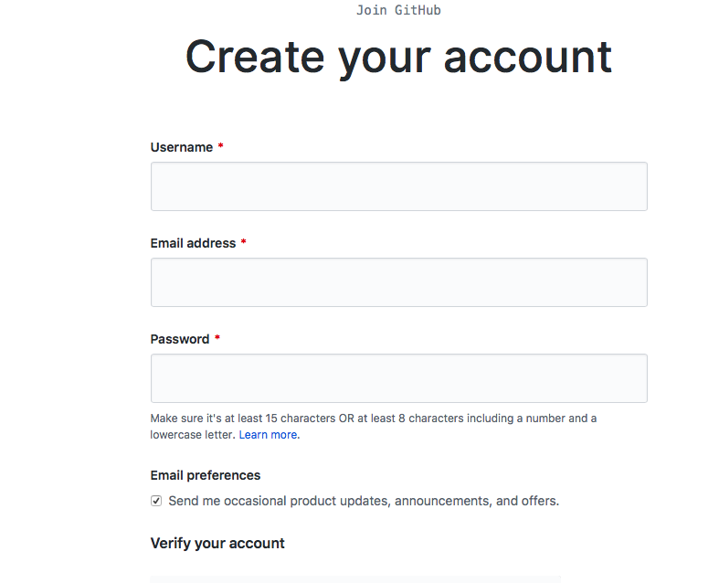
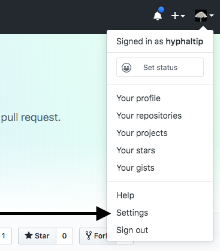
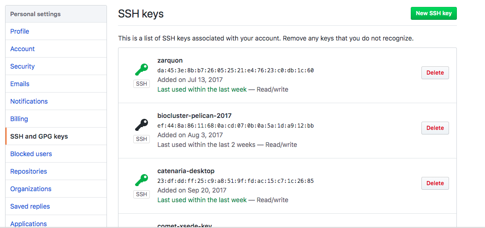
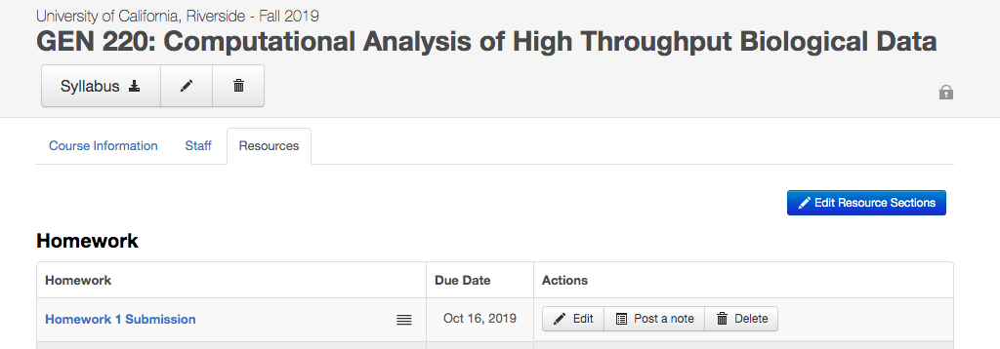
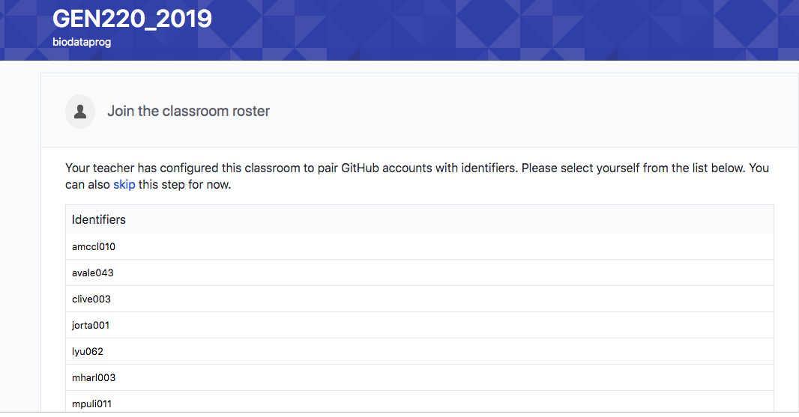
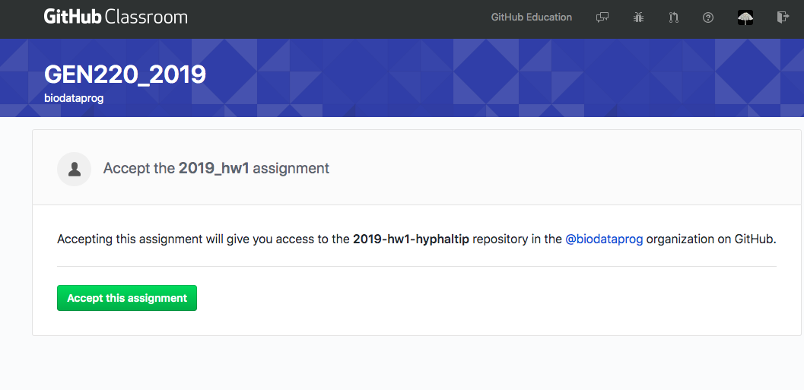
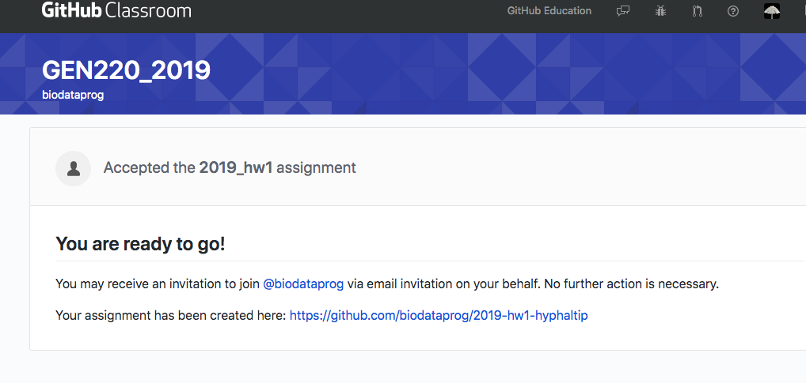
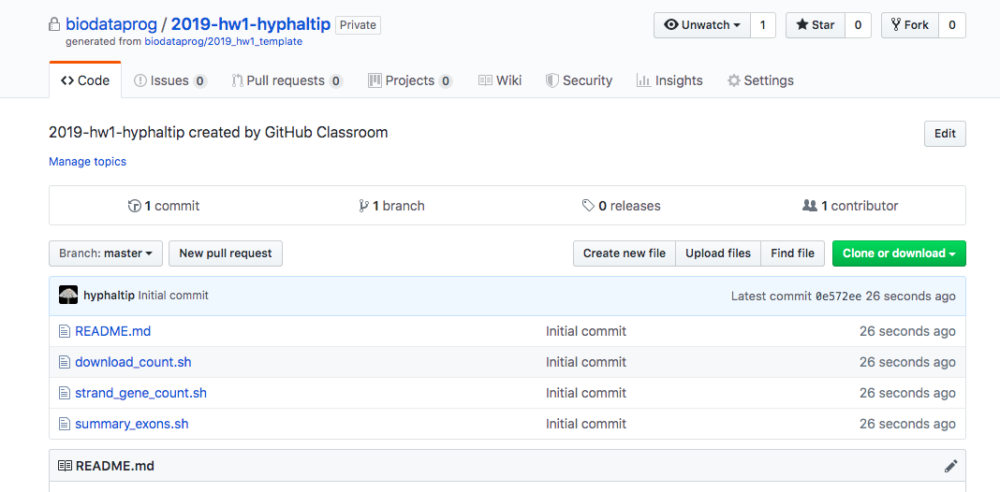

# Odds and Ends

# GZIP

Compression of files with gzip

```bash
$ gzip file.fa
# will produce
file.fa.gz
```

To uncompress
```bash
$ gunzip file.fa.gz
# will produce
file.fa
```

# Searching for text with grep

Powerful pattern seaching with `grep`

Simple search for a text string:
```bash
$ grep Chr11 /bigdata/gen220/shared/data-examples/examples/random_exons.csv
Chr11,14656670,14656778
Chr11,3528895,3530426
Chr11,16238576,16239304
```

To get the count of number of lines that match a pattern use the `-c` option.

```bash
$ grep -c Chr11 /bigdata/gen220/shared/data-examples/examples/random_exons.csv
3
```
What if we wanted to count the number of times Chr1 showed up?

```bash
$ grep Chr1 /bigdata/gen220/shared/data-examples/examples/random_exons.csv
Chr11,14656670,14656778
Chr1,1147485,1147562
Chr12,22130532,22130707
Chr10,19029658,19029760
Chr11,3528895,3530426
Chr12,23125462,23125634
Chr1,4249358,4249468
Chr11,16238576,16239304
Chr12,9264478,9264617
Chr1,18658403,18658693
Chr12,9488597,9489239
Chr1,12152,12435
Chr1,43214981,43215253
```

How can we make this a more specific query?  Well we know the ',' comes after so we can include that in the search.

```bash
$ grep Chr1, /bigdata/gen220/shared/data-examples/examples/random_exons.csv
Chr1,1147485,1147562
Chr1,4249358,4249468
Chr1,18658403,18658693
Chr1,12152,12435
Chr1,43214981,43215253
```

If you want to invert the search and find lines that DO NOT match the pattern use the `-v` option.

```bash
$ grep -c Chr1, /bigdata/gen220/shared/data-examples/examples/random_exons.csv
5
$ grep -v -c Chr1, /bigdata/gen220/shared/data-examples/examples/random_exons.csv
25
```

# Git and Github

Version control is useful for sharing code, keeping track of versions
of software and code (or any text). Distributed version control allows multiple people to work on the same project or code.

Github is a free* resource for code sharing and supports a great deal
of the software development among open source projects. 

## Creating Github Account

https://github.com/join?source=header



After you create your account - you need to setup SSH keys on your
account to simplify check-in and checkout.



You need to add SSH keys to your account and these keys should be
stored on the computer you are doing the check outs from (eg the
cluster). Follow the directions here
[https://help.github.com/en/articles/connecting-to-github-with-ssh](https://help.github.com/en/articles/connecting-to-github-with-ssh)
on how to create key pairs.
This provides simple guide
*  https://help.github.com/en/articles/generating-a-new-ssh-key-and-adding-it-to-the-ssh-agent
* add the key to your account: https://help.github.com/en/articles/adding-a-new-ssh-key-to-your-github-account

Note that creating these same pairs on your local laptop and copying the public key to your HPCC account. Some basic info is here as well. https://biodataprog.github.io/GEN220/Resources/SSH_keys




## Preparing Homework

Click on piazza links for homework submission:

[https://piazza.com/ucr/fall2019/gen220/resources](https://piazza.com/ucr/fall2019/gen220/resources)



You should link your UCR netID to your github account so I can figure
out who has which homework.



## Setting up a repository

Click through the links and accept setting up the repository.






## Checking out code

Now you have created a repository for your homework. It has been
prepopulated with code framework I started for you.



You want to check out this repository on the cluster (will also work
to check out to your laptop).

See the link in this window:


Go to your command line (on the cluster and check out your repository.

`git clone git@github.com:biodataprog/2019-hw1-hyphaltip.git`

If you cannot get this to work you can revert to using https but you
will need to enter your **Github** username and password each time you
want to commit which is annoying.

The equivalent would look like this
`git clone https://github.com/biodataprog/2019-hw1-hyphaltip.git`

## Making changes

Edit changes locally using nano or your favorite editor. When you are done you can commit these changes to the repository with git commit.

`git commit -m "message" file_changed.sh`

## Git add

If you create additional files to track you can add them to the
system.  You need to tell Git which files you want to track. This is
done with `add`

```bash
$ git add file1.sh file2.sh data/dat.tab
```

## Git commit

To save the changes in the repository you need to commit them. This commit is accompanied by a message with `-m` option

```bash
$ git commit -m "A helpful message"
```

If you forget to include a message it will prompt you
```bash
$ git commit
# will spawn an editor for you to write a message
```

## Last step - git push

To Sync your code on HPCC (or your laptop) wherever you have a git repository checked out - you still need to save and push these changes to the github "cloud". You can do this by typing

`git push`

## To get new changes

If you are collaborating on a project and someone else makes changes
to the repository, you need to sync their changes with yours. You do
this by typing

`git pull`

# Git resources

More links and helpful tutorial here

[https://guides.github.com/activities/hello-world/](https://guides.github.com/activities/hello-world/) from github.


