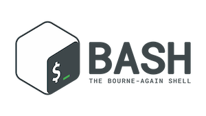

# UNIX basics and introduction to commandline tools

These lectures and resources will support learning how to use BASH and
shell scripting.

# Lectures
* 0 [Cluster Login, UNIX Basics](00_Login_Notebook) [PDF](00_Login_Notebook.pdf)
* 1 [Running Programs](01_Tools) [PDF](01_Tools.pdf)
* 2 [Analysis and Basic Programmings](02_Analysis_summary) [PDF](02_Analysis_summary.pdf)
* 3 [Wrapup and Review](03_Wrapup_and_Tools) [PDF](03_Wrapup_and_Tools.pdf)

